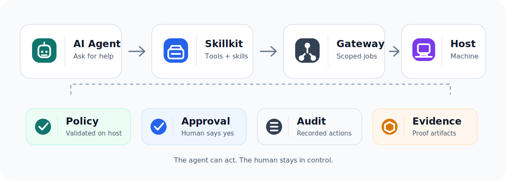

<div align="center">

# Remote Dev Skillkit

**Let AI agents safely help on real Mac, Windows, and Linux machines.**

[Install](#install) · [Use](#use) · [Docs](docs/README.md) · [Security](SECURITY.md) · [Contributing](CONTRIBUTING.md)



</div>

## What It Does

Remote Dev Skillkit is an open-source safety layer for agent-native remote
development.

It lets Codex, Claude Code, Hermes, OpenClaw/OpenCode, and MCP agents connect
to a real machine, run scoped repair work, and return audit-ready evidence
without receiving unrestricted shell access.

| Agent gets | Human keeps |
|---|---|
| Skills, MCP tools, file/desktop/task adapters | Visibility, authorization, revocation, audit |
| Signed tasks with clear capabilities | Host-local policy and security boundaries |
| Artifacts and evidence bundles | Control over what runs and when it stops |

## Install

Copy the text below and send it to your Agent:

```text
Please install Remote Dev Skillkit for your own agent runtime:
https://github.com/EitanWong/remote-dev-skillkit
```

Need the full installer contract? See
[Agent Bootstrap Prompt](docs/operations/AGENT_BOOTSTRAP_PROMPT.md).

<details>
<summary>Manual install commands</summary>

```bash
go install ./cmd/rdev
rdev doctor
rdev bootstrap agent-plan --repo-root .
```

```bash
rdev skillkit export --source-root . --out dist/remote-dev-skillkit
rdev skillkit verify --bundle dist/remote-dev-skillkit
```

```bash
rdev skillkit plan-install \
  --bundle dist/remote-dev-skillkit \
  --out dist/skillkit-install \
  --frameworks codex,claude-code,hermes,openclaw,opencode,generic-mcp-agent

rdev skillkit verify-install-plan --plan dist/skillkit-install/install-plan.json
```

```bash
rdev skillkit install --bundle dist/remote-dev-skillkit --framework codex --target ~/.codex/skills
rdev skillkit install --bundle dist/remote-dev-skillkit --framework codex --target ~/.codex/skills --execute
```

</details>

## Use

### 1. Connect A Machine

Ask your agent:

```text
Use Remote Dev Skillkit to connect this computer for a visible support session.
```

The agent should use `rdev.support_session.connect` or:

```bash
rdev support-session connect --start
```

Inspect provider eligibility before starting a tunnel, especially on mainland
China networks:

```bash
rdev tunnel providers --region cn-mainland --json
rdev tunnel probe --region cn-mainland --provider-policy /protected/path/providers.json --json
```

These inspection commands are read-only: they do not start a tunnel, accept
terms, register an account, change configuration, or print credentials. A
direct gateway or managed tunnel is reported as `degraded-single-entry` and is
not ready to send by default. For an attended session, an operator may
explicitly pass `--allow-degraded-direct-handoff`; the result remains degraded,
is not ready to activate or execute, and still requires explicit stop/cleanup.

For `--region global`, the current Agent-side order is: a configured stable
operator gateway; Cloudflare Quick Tunnel (priority 10); the managed,
checksum-pinned tunn3l v0.5.1 client (priority 20); and localhost.run with its
reviewed official host key (priority 30). Pinggy (priority 40) and other SSH
providers are considered only after an explicit operator allowlist and an exact
reviewed host pin. The target-side human still receives exactly the newly
generated `target_handoff_envelope.full_text`: one recommended public hostname
embedded in one short readable PowerShell command, not a tunnel selection UI.

If the target explicitly reports `trycloudflare.com` DNS failure or NXDOMAIN,
do not retry Cloudflare as the default and do not manually start a tunnel. In a
protected absolute work directory, create a protected provider-policy file with
only:

```json
{"disabled_provider_ids":["cloudflare-quick"]}
```

Then keep
`rdev support-session connect --start --work-dir <ABSOLUTE_PROTECTED_WORK_DIR> --region global --provider-policy <PROTECTED_POLICY_PATH>`
in the foreground. Let managed tunn3l or localhost.run take over, and send only
the new generated handoff. Do not build a multi-URL PowerShell loop or mutate
DNS, hosts, proxy, firewall, or target bootstrap state. One successful sample
does not become `cn-mainland` evidence.

Anonymous/account-free tunnels are availability candidates, not guaranteed
mainland-China services. `cn-mainland` remains fail-closed without fresh
verified China Telecom, China Unicom, and China Mobile evidence. tunn3l's
`Anonymous=true` means no account or registration is required; it is not a
privacy or no-telemetry guarantee. In v0.5.1, the upstream client creates a
`dv_` plus 24-hex device ID ([source](https://github.com/bdecrem/tunn3l/blob/2025a09e880bb6df4395ea8c65a6949a97265e44/cli/bore.js#L35-L42))
and sends that ID, the Agent hostname, and Agent OS in relay registration
metadata ([source](https://github.com/bdecrem/tunn3l/blob/2025a09e880bb6df4395ea8c65a6949a97265e44/cli/bore.js#L163-L169)).
`rdev` gives it a fresh empty session `HOME`/`USERPROFILE`/XDG config and clears
tunn3l credentials, subdomain/password overrides, and runtime preload variables,
so it does not reuse the user's real `~/.tunn3l` and generates a new
session-scoped ID. The relay still observes normal network and HTTP tunnel
traffic. These statements are pinned to that v0.5.1 source commit and must not
be generalized to other releases.

### 2. Run Scoped Work

The agent creates signed tasks for specific capabilities: shell, PowerShell,
files, desktop, Codex, Claude Code, or adapter workflows.

Examples:

```bash
rdev mcp tools
rdev demo local
```

### 3. Review Evidence

Tasks return artifacts, audit events, and evidence bundles before the agent
claims the work is complete.

```bash
go test ./...
rdev acceptance fresh-agent-support-session --out .rdev/acceptance/fresh-agent-support-session
```

## Built For

| Scenario | Why it fits |
|---|---|
| Remote debugging | Agent can inspect, run tests, and collect evidence |
| Environment repair | Host policy controls what commands can run |
| Support sessions | Target user sees and can revoke the session |
| Agent framework setup | Same Skillkit works across major agent runtimes |
| Adapter development | `pkg/adapterkit` provides conformance helpers |

## Safety

Remote Dev Skillkit is for explicit, consent-based remote development.

It rejects hidden persistence, UAC or sudo bypass, disabled local security
controls, public inbound listeners on target hosts by default, and unrestricted
shell access without policy enforcement.

## Docs

| Topic | Link |
|---|---|
| Documentation index | [docs/README.md](docs/README.md) |
| Install details | [Skillkit Install](docs/operations/SKILLKIT_INSTALL.md) |
| MCP tools | [MCP Stdio](docs/operations/MCP_STDIO.md) |
| Bootstrap flow | [Bootstrap](docs/operations/BOOTSTRAP.md) |
| Architecture | [Architecture](docs/architecture/ARCHITECTURE.md) |
| Threat model | [Threat Model](docs/security/THREAT_MODEL.md) |

## Languages

[English](README.md) ·
[简体中文](docs/i18n/README.zh-CN.md) ·
[Español](docs/i18n/README.es.md) ·
[Français](docs/i18n/README.fr.md) ·
[Deutsch](docs/i18n/README.de.md) ·
[日本語](docs/i18n/README.ja.md) ·
[한국어](docs/i18n/README.ko.md) ·
[Português](docs/i18n/README.pt-BR.md) ·
[हिन्दी](docs/i18n/README.hi.md) ·
[العربية](docs/i18n/README.ar.md) ·
[Русский](docs/i18n/README.ru.md)

## Develop

```bash
scripts/check.sh
```

License: [Apache-2.0](LICENSE)
